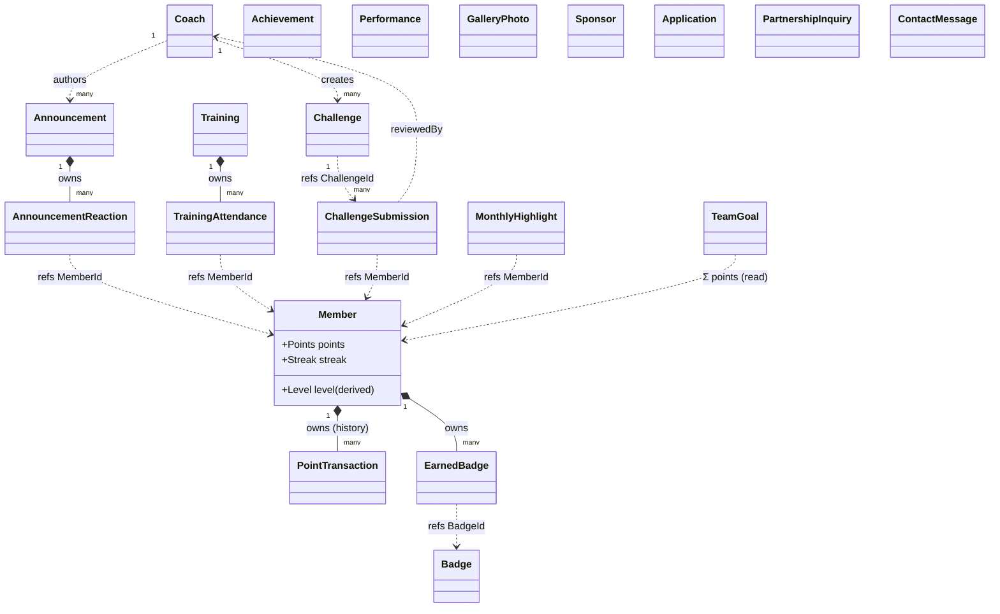

# MT Sorella — Domain Model

> **Status:** design document for [issue #24](https://github.com/xforman2/mtsorella/issues/24)
> (`feat: model the MT Sorella domain layer`). This is the **plan for implementing** the `Domain/`
> layer of the .NET backend — it is **domain-only, no persistence** (no EF mappings, migrations,
> repositories, feature slices, or auth wiring).
>
> **Sources:** derived from [requirements.md](requirements.md) (FR-* / FE-* / BE-* IDs) and the
> high-fidelity [prototype](prototype/MT%20Sorella.html). Conventions follow
> [.claude/skills/dotnet-backend/SKILL.md](.claude/skills/dotnet-backend/SKILL.md).
>
> The C# below is **illustrative** (shapes, fields, signatures, invariants) — close to house style
> but not the final compilable code. The goal is to lock the model and its decisions before coding.
>
> **Provenance (how to verify this is valid):** every aggregate, value object, and enum below is
> tagged with the [requirements.md](requirements.md) ID(s) it derives from, so each piece is
> traceable back to the spec. ID prefixes: **FR-S** = system, **FR-P** = public area, **FR-M** =
> member zone, **FR-A** = admin panel, **BE** = backend, **FE** = frontend. A few enum *values*
> come from the [prototype](prototype/MT%20Sorella.html) and are marked `(prototype)`. The
> **[§7 coverage table](#7-requirements-coverage-no-silent-gaps)** maps every spec ID → model (and
> back) so you can check nothing is missing or invented.

---

## Domain map (at a glance)

> The big picture first: aggregates and how they relate. Solid diamond (`*--`) = ownership within
> one aggregate; dashed (`..>`) = a cross-aggregate reference held **by ID only** (decision D5).
> Each box is detailed in [§4](#4-aggregates) with its `requirements.md` source IDs.


*Standalone aggregates (no cross-links): **Achievement, Performance, GalleryPhoto, Sponsor,
Application, PartnershipInquiry, ContactMessage**.*

---

## 1. Guiding decisions

| # | Decision | Why |
|---|----------|-----|
| D1 | **Rich domain model** — aggregates encapsulate state behind private setters; mutation happens through intent-revealing methods and `static Create(...)` factories. | Invariants live in one place; no anaemic POCOs that any code can corrupt. |
| D2 | **Factories + `ErrorOr<T>`** for any construction/operation that can fail; **never throw** for expected validation failures. | Matches the backend's `ErrorOr` convention; failures are values handlers can map to HTTP. |
| D3 | **Value objects as `sealed record`** (and `readonly record struct` for IDs). Validated VOs use a private ctor + `static Create(...) : ErrorOr<T>`. | Records give value-equality + immutability for free; the skill encourages records for immutable data. |
| D4 | **Strongly-typed IDs** — `readonly record struct MemberId(Guid Value)` etc. | Kills "pass the wrong Guid" bugs; makes signatures self-documenting. |
| D5 | **Aggregates reference each other by ID only** (no navigation properties across aggregate boundaries). Children are owned within their root. | Keeps aggregate boundaries crisp; persistence/loading stays simple and consistent. |
| D6 | **Domain events are raised and held, not dispatched.** `AggregateRoot` collects them; a marker `IDomainEvent`. No publisher/handlers in this issue. | Captures cross-aggregate rules now; wiring to Mediator's `IPublisher` is a later step. |
| D7 | **Enums are language-neutral.** The prototype's Slovak labels (Juniorky, Zlato, …) map to neutral enum members; display text is a frontend/localization concern. | Domain shouldn't bake in a UI language; FE issues already discuss SK→CZ copy. |
| D8 | **Read models are not aggregates.** Leaderboard, hero/summary stats, and attendance % are queries/projections, documented as boundaries (§8). | They derive from aggregates; modelling them as entities would duplicate truth. |
| D9 | **`Badge` is its own catalog aggregate** (name/description/icon/criteria); members hold `EarnedBadge` value objects that reference it by `BadgeId`. | Spec calls for admins **managing and assigning** badges ([BE-20](requirements.md#63-gamification-and-points-system)) — that needs a managed catalog, not a hard-coded enum. |
| D10 | **`Coach` is modelled separately from the login/admin account.** The coach↔admin user account is an auth boundary (§8). | A coach is public-profile domain data ([FR-P18–P20](requirements.md#24-coaches-public)); credentials/roles are an identity concern with a different lifecycle. |

### Folder layout (target)

```
backend/src/Mtsorella.Api/Domain/
├── Common/                      # building blocks (D3–D6)
│   ├── Entity.cs                # Entity<TId>
│   ├── AggregateRoot.cs         # AggregateRoot<TId> + domain-event collection
│   └── IDomainEvent.cs
├── Members/                     # Member root + PointTransaction, EarnedBadge, events
├── Badges/                      # Badge catalog root
├── Coaches/
├── Trainings/                   # Training root + TrainingAttendance
├── Challenges/                  # Challenge + ChallengeSubmission roots
├── Announcements/               # Announcement + AnnouncementReaction
├── Achievements/
├── Performances/
├── TeamGoals/
├── Highlights/                  # MonthlyHighlight (majorette of the month)
├── Gallery/                     # GalleryPhoto
├── Sponsors/
└── Inbox/                       # Application, PartnershipInquiry, ContactMessage
```
Shared value objects/enums used by many aggregates (`Email`, `PhoneNumber`, `Points`, `Level`,
`Streak`, `MediaRef`, `MemberCategory`, …) live in `Domain/Common/` (or a `Domain/Common/ValueObjects`
sub-folder); aggregate-specific VOs live with their aggregate.

> The throwaway [`Domain/Product.cs`](backend/src/Mtsorella.Api/Domain/Product.cs) and its
> repository/feature/`DbSet`/migration are **not touched here** — that cleanup rides with the
> persistence issue (deleting `Product` would break the current build).

---

## 2. Building blocks (`Domain/Common/`)

```csharp
namespace Mtsorella.Api.Domain.Common;

// Identity + identity-based equality. TId is a strongly-typed id (record struct).
public abstract class Entity<TId> : IEquatable<Entity<TId>>
    where TId : struct
{
    public TId Id { get; protected init; }

    public bool Equals(Entity<TId>? other) =>
        other is not null && other.GetType() == GetType() && other.Id.Equals(Id);

    public override bool Equals(object? obj) => obj is Entity<TId> e && Equals(e);
    public override int GetHashCode() => HashCode.Combine(GetType(), Id);
}
```

```csharp
namespace Mtsorella.Api.Domain.Common;

// Marker for things that happened in the domain. Dispatch is deferred (D6).
public interface IDomainEvent;

// Aggregate root: an entity that is the consistency boundary and the only thing repositories load.
// It collects domain events raised while handling behaviour; infrastructure drains them later.
public abstract class AggregateRoot<TId> : Entity<TId>
    where TId : struct
{
    private readonly List<IDomainEvent> _domainEvents = new();
    public IReadOnlyCollection<IDomainEvent> DomainEvents => _domainEvents.AsReadOnly();

    protected void RaiseDomainEvent(IDomainEvent domainEvent) => _domainEvents.Add(domainEvent);
    public void ClearDomainEvents() => _domainEvents.Clear();
}
```

**Strongly-typed IDs** — one per aggregate (and per owned entity that needs one):

```csharp
public readonly record struct MemberId(Guid Value)
{
    public static MemberId New() => new(Guid.NewGuid());
}
// …CoachId, TrainingId, ChallengeId, ChallengeSubmissionId, AnnouncementId, AchievementId,
//   PerformanceId, TeamGoalId, MonthlyHighlightId, GalleryPhotoId, SponsorId, BadgeId,
//   ApplicationId, PartnershipInquiryId, ContactMessageId, PointTransactionId.
```

---

## 3. Value objects & enums

### 3.1 Enums (language-neutral; SK label = prototype display only)

```csharp
public enum Role { Guest, Member, Admin }                 // FR-S4 (Admin = coach)

public enum MemberCategory { Juniors, Cadets, Seniors }   // Juniorky / Kadetky / Seniorky — FR-M12

public enum CompetitionType { Regional, National, International } // Regionálna / Národná / Medzinárodná — FR-P16

public enum Medal { None, Bronze, Silver, Gold }          // bronze / silver / gold — FR-P16

public enum PhotoCategory { Competition, Training, Performance, BehindTheScenes }
                                                          // Súťaž / Tréning / Vystúpenie / Zákulisie — FR-P11

public enum AttendanceStatus { Unknown, Attending, NotAttending } // FR-M6 / FR-M16

public enum SubmissionStatus { Submitted, UnderReview, Reviewed } // FR-M26 / FR-A6

public enum AnnouncementReactionType { Like, Heart }      // FR-M22

public enum PointSource { TrainingAttendance, ChallengeCompletion, ChallengeQuality, Bonus, Manual }
                                                          // FR-M17 / FR-M27 / FR-A6

public enum CooperationType { Financial, Material, Media, Other } // FR-P32 — ⚠ assumption, confirm exact set

public enum LevelTier { Bronze, BronzePlus, Silver, Gold, GoldPlus, Diamond }
                                                          // Bronz / Bronz+ / Striebro / Zlato / Zlato+ / Diamant
```

### 3.2 Value objects

```csharp
// Validated e-mail. Member login identity + application/partnership/contact forms.
// FR-M1 (login) / FR-P26 (contact) / FR-P29 (application) / FR-P32 (partnership)
public sealed record Email
{
    public string Value { get; }
    private Email(string value) => Value = value;
    public static ErrorOr<Email> Create(string? raw) =>
        string.IsNullOrWhiteSpace(raw) || !raw.Contains('@')      // real impl: stricter check
            ? Error.Validation("Email.Invalid", "E-mail is not valid.")
            : new Email(raw.Trim());
}

public sealed record PhoneNumber                              // FR-P29 / FR-P32 / FR-P27
{
    public string Value { get; }
    private PhoneNumber(string value) => Value = value;
    public static ErrorOr<PhoneNumber> Create(string? raw) => /* normalize + validate */ ...;
}

// Non-negative score balance. The single source of truth for "how many points".
public readonly record struct Points
{
    public int Value { get; }
    private Points(int value) => Value = value;
    public static ErrorOr<Points> From(int value) =>
        value < 0 ? Error.Validation("Points.Negative", "Points cannot be negative.") : new Points(value);
    public static Points Zero => new(0);
    public Points Add(int delta) => new(Math.Max(0, Value + delta)); // never drops below 0 (D1)
}

// Level is DERIVED from Points via the fixed 6-rung ladder (prototype values). Not stored.
//   0–100 Začiatočník(Bronze) · 101–300 Mierne pokročilá(Bronze+) · 301–600 Pokročilá(Silver)
//   · 601–1000 Profesionál(Gold) · 1001–1500 Hviezda(Gold+) · 1501+ Sorella(Diamond) — FR-M40/M41
public sealed record Level(int Rung, string Name, LevelTier Tier, int Min, int? Max)
{
    public static Level For(Points points);                 // maps points → rung
    public int? PointsToNext(Points points);                // FR-M35 progress to next level
    // The ladder table lives as a static readonly array in this type.
}

// Consecutive-activity streak with milestone detection. FR-M42 (prototype: streak: 12).
public readonly record struct Streak(int Current, int Longest, DateOnly? LastActiveOn)
{
    public Streak Register(DateOnly day);                   // ++ if consecutive, reset if gap
    public bool CrossedMilestone(int previousCurrent);      // e.g. 7/30/100-day milestones
}

// Reference to stored media. The bytes/storage are a boundary (BE-21/22); domain only points at them.
public sealed record MediaRef(MediaKind Kind, string StorageKey, string? AltText = null);
public enum MediaKind { Image, Video }

// Training schedule pattern. FR-A8 (recurring trainings).
public sealed record Recurrence(RecurrenceFrequency Frequency, IReadOnlySet<DayOfWeek> Days, DateOnly? Until);
public enum RecurrenceFrequency { None, Weekly }

// Computed challenge score. FR-M27 / FR-A6 / BE-17.
public sealed record ChallengeScore(int Completion, int OnTimeBonus, int Quality) // 10 · {0,5} · 0..20
{
    public int Total => Completion + OnTimeBonus + Quality;
    public static ErrorOr<ChallengeScore> Create(int quality, bool onTime); // guards quality 0..20
}

public readonly record struct DateOfBirth(DateOnly Value)   // FR-P28
{
    public int AgeOn(DateOnly today);
}

public sealed record Placement(int? Rank, string Label);     // FR-P16 "placement" (e.g. 1st / "Finalist")

public readonly record struct YearMonth(int Year, int Month); // MonthlyHighlight key
```

---

## 4. Aggregates

Legend per aggregate: **purpose → fields (commented) → invariants → behaviour → events → spec IDs.**
Each model is preceded by a **Decisions** line (the modelling rationale, linking to
[§1](#1-guiding-decisions)) and a **Verify ↗** line (clickable jumps to the exact
[requirements.md](requirements.md) sections), so you can read the decision and check the source
without leaving the model or hunting for the [§7 table](#7-requirements-coverage-no-silent-gaps).

### 4.1 Member  — `Domain/Members/` *(aggregate root)*
The gamified team member. Created by an admin only; accumulates points, levels up, earns badges.

> **Decisions:** rich aggregate — points/level/streak encapsulated, mutated only via methods ([D1](#1-guiding-decisions)); `Level` is derived from `Points` and enums are language-neutral ([D7](#1-guiding-decisions)); badges are a separate catalog referenced as `EarnedBadge` ([D9](#1-guiding-decisions)); attendance %/rank are read models ([D8](#1-guiding-decisions)).
>
> **Verify ↗** [Team](requirements.md#33-team-members) `FR-M11–M13` · [Profile](requirements.md#39-profile) / [Levels & Points](requirements.md#310-levels-and-points) `FR-M34–M42` · [CRUD](requirements.md#62-data-and-crud-operations) `BE-6` · [Gamification](requirements.md#63-gamification-and-points-system) `BE-15`

```csharp
public sealed class Member : AggregateRoot<MemberId>
{
    public string FullName { get; private set; }            // FR-M13
    public string? Nickname { get; private set; }           // FR-M13 / FR-M34
    public MemberCategory Category { get; private set; }    // FR-M12 (Juniors/Cadets/Seniors)
    public string? TeamRole { get; private set; }           // FR-M13 free role, e.g. "Kapitánka"
    public int YearsInTeam { get; private set; }            // FR-M13
    public string? Bio { get; private set; }                // FR-M13
    public Email ParentEmail { get; private set; }          // login identity (auth is a boundary §8) — FR-M1
    public MediaRef? Photo { get; private set; }            // FR-M39 profile photo
    public Points Points { get; private set; }              // FR-M40 single source of truth
    public Level Level => Level.For(Points);                // derived (D7) — FR-M40/M41
    public Streak Streak { get; private set; }              // FR-M42
    public bool IsActive { get; private set; }

    private readonly List<PointTransaction> _pointHistory = new();   // FR-M37 owned
    public IReadOnlyList<PointTransaction> PointHistory => _pointHistory;
    private readonly List<EarnedBadge> _badges = new();              // FR-M36 owned (refs BadgeId)
    public IReadOnlyList<EarnedBadge> Badges => _badges;

    // Behaviour ------------------------------------------------------------
    public static ErrorOr<Member> Create(string fullName, MemberCategory cat, Email parentEmail, ...);
    public void AwardPoints(int amount, PointSource source, string reason, DateTime occurredOn);
        // appends PointTransaction, bumps Points, raises MemberPointsAwarded; if Level rung
        // increases → MemberLeveledUp. (FR-M17 / FR-M27 / BE-15)
    public void RegisterAttendanceActivity(DateOnly day);  // updates Streak; StreakMilestoneReached
    public ErrorOr<Success> EarnBadge(BadgeId badgeId, DateTime earnedOn); // idempotent → BadgeEarned
    public void UpdateProfile(string fullName, string? nickname, Email parentEmail, MediaRef? photo); // FR-M39
}
```
- **Invariants:** name non-empty; `Points` never negative; `Level` always consistent with `Points`;
  a badge is earned at most once.
- **Events:** `MemberCreated`, `MemberPointsAwarded`, `MemberLeveledUp`, `BadgeEarned`,
  `StreakMilestoneReached`.

```csharp
// Owned entity — one line in the points history. FR-M37.
public sealed class PointTransaction : Entity<PointTransactionId>
{
    public int Amount { get; private init; }        // signed (awards are positive)
    public PointSource Source { get; private init; }
    public string Reason { get; private init; }     // e.g. "Tréning 12.6.", "Výzva: Technika"
    public DateTime OccurredOn { get; private init; }
}

// Owned value object — which badge this member earned, and when.
public sealed record EarnedBadge(BadgeId BadgeId, DateTime EarnedOn);
```

> **Attendance % / leaderboard rank** shown on the dashboard (FR-M5/M35) are **not** stored on
> Member — they are read models computed across `Training`/`Member` (§8).

### 4.2 Badge — `Domain/Badges/` *(aggregate root)*
Catalog of awardable badges; admins manage the catalog and assign them (BE-20). Members reference
earned badges by `BadgeId` (4.1).

> **Decisions:** its own catalog aggregate so admins can manage/assign badges — not a hard-coded enum ([D9](#1-guiding-decisions)).
>
> **Verify ↗** [Profile](requirements.md#39-profile) `FR-M36` · [Gamification](requirements.md#63-gamification-and-points-system) `BE-20`

```csharp
public sealed class Badge : AggregateRoot<BadgeId>
{
    public string Name { get; private set; }            // FR-M36
    public string Description { get; private set; }
    public MediaRef? Icon { get; private set; }
    public string? Criteria { get; private set; }       // human description of how it's earned
    public bool IsActive { get; private set; }
    public static ErrorOr<Badge> Create(string name, string description, ...);
}
```

### 4.3 Coach — `Domain/Coaches/` *(aggregate root)*
Coaching staff. Publicly visible subset only (privacy: members are never public). Coaches act as
admins (the admin↔coach account link is an auth boundary, §8).

> **Decisions:** modelled separately from the login/admin account ([D10](#1-guiding-decisions)); `ShowOnWebsite` gates public visibility.
>
> **Verify ↗** [Coaches (public)](requirements.md#24-coaches-public) `FR-P18–P20` · [Admin](requirements.md#4-admin-panel-coaches--management) `FR-A5` · [CRUD](requirements.md#62-data-and-crud-operations) `BE-7`

```csharp
public sealed class Coach : AggregateRoot<CoachId>
{
    public string FullName { get; private set; }        // FR-P19
    public string RoleTitle { get; private set; }       // FR-P19 e.g. "Hlavná trénerka"
    public int YearsInTeam { get; private set; }        // FR-P19
    public string Bio { get; private set; }             // FR-P19
    public MediaRef? Photo { get; private set; }
    public bool ShowOnWebsite { get; private set; }     // FR-A5 / FR-P18 publish flag
    public static ErrorOr<Coach> Create(...);
    public void Show();   public void Hide();           // FR-A5
    public void Edit(...);
}
```

### 4.4 Training — `Domain/Trainings/` *(aggregate root)*
A scheduled training; members confirm attendance and earn points for showing up.

> **Decisions:** owns its `TrainingAttendance` rows ([D5](#1-guiding-decisions)); attendance points are awarded via a domain event, not by reaching into `Member` ([D6](#1-guiding-decisions)).
>
> **Verify ↗** [Trainings](requirements.md#34-trainings) `FR-M14–M18` · [Admin](requirements.md#4-admin-panel-coaches--management) `FR-A8` · [CRUD](requirements.md#62-data-and-crud-operations) `BE-9` · [Gamification](requirements.md#63-gamification-and-points-system) `BE-16`

```csharp
public sealed class Training : AggregateRoot<TrainingId>
{
    public DateTimeOffset StartsAt { get; private set; } // FR-M15
    public DateTimeOffset EndsAt { get; private set; }
    public string Location { get; private set; }         // FR-M15
    public MemberCategory Category { get; private set; } // which group — FR-M15
    public string? WhatToBring { get; private set; }     // FR-M15
    public Recurrence Recurrence { get; private set; }   // FR-A8
    public int AttendancePoints { get; private set; }    // points granted on Attending — FR-M17

    private readonly List<TrainingAttendance> _attendances = new();  // owned
    public IReadOnlyList<TrainingAttendance> Attendances => _attendances;

    public static ErrorOr<Training> Create(...);
    public void Reschedule(DateTimeOffset startsAt, DateTimeOffset endsAt);
    public ErrorOr<Success> ConfirmAttendance(MemberId memberId, AttendanceStatus status);
        // upserts the member's row; on first Attending raises TrainingAttendanceConfirmed
        // (carries AttendancePoints) → Member.AwardPoints + RegisterAttendanceActivity via handler.
}

public sealed class TrainingAttendance : Entity<Guid>   // owned; identity is (TrainingId, MemberId)
{
    public MemberId MemberId { get; private init; }      // FR-M16
    public AttendanceStatus Status { get; private set; }
    public DateTime? ConfirmedOn { get; private set; }
}
```
- **Invariants:** `EndsAt > StartsAt`; one attendance row per member; points awarded once per member.
- **Events:** `TrainingScheduled`, `TrainingAttendanceConfirmed`.

### 4.5 Challenge — `Domain/Challenges/` *(aggregate root)*
A gamification task with an instructional video, deadline, and reward (FR-M23, FR-A7).

> **Decisions:** kept separate from its submissions — different lifecycle and authors ([D5](#1-guiding-decisions)).
>
> **Verify ↗** [Challenges](requirements.md#36-challenges-gamification) `FR-M23` · [Admin](requirements.md#4-admin-panel-coaches--management) `FR-A7` · [CRUD](requirements.md#62-data-and-crud-operations) `BE-11`

```csharp
public sealed class Challenge : AggregateRoot<ChallengeId>
{
    public string Name { get; private set; }             // FR-M23
    public string Description { get; private set; }
    public string? Category { get; private set; }        // e.g. "Technika" (prototype)
    public DateTimeOffset Deadline { get; private set; } // FR-M23
    public int CompletionPoints { get; private set; }    // base reward, default 10 — FR-M27
    public MediaRef InstructionalVideo { get; private set; } // FR-M23
    public CoachId CreatedBy { get; private set; }       // FR-A7
    public bool IsActive { get; private set; }
    public static ErrorOr<Challenge> Create(...);
    public void Close();
}
```
- **Events:** `ChallengeCreated`.

### 4.6 ChallengeSubmission — `Domain/Challenges/` *(aggregate root)*
A member's video response to a challenge; a coach reviews it and the score becomes points. Separate
aggregate from `Challenge` (different lifecycle, written by different actors — D5).

> **Decisions:** own aggregate referencing `Challenge` + `Member` by ID ([D5](#1-guiding-decisions)); snapshots the deadline so on-time is computed without loading the challenge; review awards points via a domain event ([D6](#1-guiding-decisions)). Open question [O1](#9-open-questions--assumptions-to-confirm).
>
> **Verify ↗** [Challenges](requirements.md#36-challenges-gamification) `FR-M24–M27` · [Admin](requirements.md#4-admin-panel-coaches--management) `FR-A6` · [Gamification](requirements.md#63-gamification-and-points-system) `BE-17` · [Communication](requirements.md#65-communication-and-integrations) `BE-27`

```csharp
public sealed class ChallengeSubmission : AggregateRoot<ChallengeSubmissionId>
{
    public ChallengeId ChallengeId { get; private set; }     // FR-M24
    public MemberId MemberId { get; private set; }
    public MediaRef Video { get; private set; }              // FR-M24 uploaded video
    public DateTimeOffset SubmittedOn { get; private set; }
    public DateTimeOffset DeadlineSnapshot { get; private set; } // captured at submit → on-time calc w/o loading Challenge (D5)
    public SubmissionStatus Status { get; private set; }     // FR-M26
    public ChallengeScore? Score { get; private set; }       // set on review — FR-M26 rating
    public CoachId? ReviewedBy { get; private set; }
    public string? ReviewComment { get; private set; }
    public DateTimeOffset? ReviewedOn { get; private set; }

    public static ErrorOr<ChallengeSubmission> Submit(ChallengeId, MemberId, MediaRef, DateTimeOffset deadline);
        // status = Submitted; raises ChallengeSubmissionCreated
    public ErrorOr<Success> Review(int quality, CoachId by, string? comment); // FR-A6
        // guards 0..20 & status; computes ChallengeScore (10 + onTime?5:0 + quality);
        // status = Reviewed; raises ChallengeSubmissionReviewed (carries Score.Total) → Member.AwardPoints
}
```
- **Invariants:** quality ∈ [0,20]; review allowed only from `Submitted`/`UnderReview`; scored once.
  *(Open question O1: one submission per member per challenge? — see §9.)*
- **Events:** `ChallengeSubmissionCreated`, `ChallengeSubmissionReviewed`.

### 4.7 Announcement — `Domain/Announcements/` *(aggregate root)*
Board post from a coach; can be pinned; members react. (FR-M19–M22, FR-A10)

> **Decisions:** owns its reactions ([D5](#1-guiding-decisions)), one per member; `React` returns `ErrorOr` rather than throwing ([D2](#1-guiding-decisions)).
>
> **Verify ↗** [Announcement Board](requirements.md#35-announcement-board) `FR-M19–M22` · [Admin](requirements.md#4-admin-panel-coaches--management) `FR-A10` · [CRUD](requirements.md#62-data-and-crud-operations) `BE-10`

```csharp
public sealed class Announcement : AggregateRoot<AnnouncementId>
{
    public CoachId AuthorId { get; private set; }
    public string Title { get; private set; }
    public string Body { get; private set; }
    public bool IsPinned { get; private set; }           // FR-M20 / FR-A10
    public DateTimeOffset PublishedOn { get; private set; }

    private readonly List<AnnouncementReaction> _reactions = new(); // owned
    public IReadOnlyList<AnnouncementReaction> Reactions => _reactions;

    public static ErrorOr<Announcement> Publish(CoachId author, string title, string body);
    public void Pin();   public void Unpin();            // FR-M20
    public ErrorOr<Success> React(MemberId memberId, AnnouncementReactionType type); // FR-M22
    public void RemoveReaction(MemberId memberId);
}

public sealed record AnnouncementReaction(MemberId MemberId, AnnouncementReactionType Type, DateTime On);
```
- **Invariant:** at most one reaction per member (re-reacting replaces).
- **Events:** `AnnouncementPublished`, `AnnouncementPinned`.

### 4.8 Achievement — `Domain/Achievements/` *(aggregate root)*
A public award on the timeline. (FR-P14–P17, FR-A11)

> **Decisions:** standalone aggregate; created/edited via a factory returning `ErrorOr` ([D1](#1-guiding-decisions) / [D2](#1-guiding-decisions)).
>
> **Verify ↗** [Achievements](requirements.md#23-achievements) `FR-P14–P17` · [Admin](requirements.md#4-admin-panel-coaches--management) `FR-A11` · [CRUD](requirements.md#62-data-and-crud-operations) `BE-8`

```csharp
public sealed class Achievement : AggregateRoot<AchievementId>
{
    public int Year { get; private set; }                // FR-P15 filter by year
    public CompetitionType CompetitionType { get; private set; } // FR-P16
    public string Name { get; private set; }             // FR-P16
    public Placement Placement { get; private set; }     // FR-P16
    public Medal Medal { get; private set; }             // FR-P16
    public string Description { get; private set; }      // FR-P16
    public static ErrorOr<Achievement> Create(...);
    public void Edit(...);
}
```

### 4.9 Performance — `Domain/Performances/` *(aggregate root)*
Upcoming public event for the calendar (`.ics` export is a boundary). (FR-P21, FR-A9)

> **Decisions:** standalone; `.ics` calendar export is infrastructure, kept as a boundary ([D8](#1-guiding-decisions) / §8).
>
> **Verify ↗** [Performances](requirements.md#25-performances) `FR-P21–P23` · [Admin](requirements.md#4-admin-panel-coaches--management) `FR-A9` · [CRUD](requirements.md#62-data-and-crud-operations) `BE-9`

```csharp
public sealed class Performance : AggregateRoot<PerformanceId>
{
    public string Name { get; private set; }             // FR-P21
    public DateTimeOffset StartsAt { get; private set; } // FR-P21
    public string Location { get; private set; }         // FR-P21
    public string Type { get; private set; }             // FR-P21 e.g. "Súťaž" / "Vystúpenie"
    public static ErrorOr<Performance> Create(...);
}
```

### 4.10 TeamGoal — `Domain/TeamGoals/` *(aggregate root)*
A shared points target; progress is the sum of members' points (aggregated into a snapshot — D5/§8).
History = past goals with `Completed` status. (FR-P6, FR-M32–M33, FR-A12, BE-19)

> **Decisions:** progress is a synced snapshot of Σ member points kept via events, not a live cross-aggregate read ([D5](#1-guiding-decisions) / [D6](#1-guiding-decisions)); history = past `Completed` goals.
>
> **Verify ↗** [Home](requirements.md#21-home-page) `FR-P6` · [Team Goals](requirements.md#38-team-goals) `FR-M32–M33` · [Admin](requirements.md#4-admin-panel-coaches--management) `FR-A12` · [Gamification](requirements.md#63-gamification-and-points-system) `BE-19`

```csharp
public sealed class TeamGoal : AggregateRoot<TeamGoalId>
{
    public string Title { get; private set; }
    public Points Target { get; private set; }           // FR-M32
    public Points Progress { get; private set; }         // snapshot, synced from Σ member points
    public TeamGoalStatus Status { get; private set; }   // Active / Completed
    public DateOnly StartedOn { get; private set; }
    public DateOnly? CompletedOn { get; private set; }   // FR-M33 history
    public static ErrorOr<TeamGoal> Create(string title, Points target);
    public void RecordProgress(Points current);          // → may auto-Complete → TeamGoalCompleted
}
public enum TeamGoalStatus { Active, Completed }
```

### 4.11 MonthlyHighlight — `Domain/Highlights/` *(aggregate root)*
"Majorette of the month." One per month. (FR-P5, FR-A12)

> **Decisions:** references the highlighted `Member` by ID ([D5](#1-guiding-decisions)); unique per month.
>
> **Verify ↗** [Home](requirements.md#21-home-page) `FR-P5` · [Admin](requirements.md#4-admin-panel-coaches--management) `FR-A12`

```csharp
public sealed class MonthlyHighlight : AggregateRoot<MonthlyHighlightId>
{
    public YearMonth Month { get; private set; }
    public MemberId MemberId { get; private set; }       // FR-P5
    public string Reason { get; private set; }           // FR-P5 reasoning
    public MediaRef? Photo { get; private set; }
    public static ErrorOr<MonthlyHighlight> Create(YearMonth month, MemberId member, string reason);
}
```
- **Invariant:** unique per `Month` (enforced at app/persistence level too).

### 4.12 GalleryPhoto — `Domain/Gallery/` *(aggregate root)*
A photo in the public gallery, categorised and dated. (FR-P10–P13, BE-13)

> **Decisions:** points at stored media via `MediaRef`; the bytes/storage are a boundary ([D8](#1-guiding-decisions) / §8).
>
> **Verify ↗** [Gallery](requirements.md#22-gallery) `FR-P10–P13` · [CRUD](requirements.md#62-data-and-crud-operations) `BE-13` · [Media](requirements.md#64-media-and-files) `BE-21`

```csharp
public sealed class GalleryPhoto : AggregateRoot<GalleryPhotoId>
{
    public MediaRef Media { get; private set; }          // FR-P10
    public PhotoCategory Category { get; private set; }   // FR-P11 / FR-P13
    public int Year { get; private set; }                // FR-P13
    public string? Caption { get; private set; }
    public static ErrorOr<GalleryPhoto> Create(...);
    public void Recategorize(PhotoCategory category);
}
```

### 4.13 Sponsor — `Domain/Sponsors/` *(aggregate root)*
A partner/sponsor shown on the site. (FR-P24, FR-A13, BE-12)

> **Decisions:** standalone aggregate; factory + `ErrorOr` ([D1](#1-guiding-decisions) / [D2](#1-guiding-decisions)).
>
> **Verify ↗** [Sponsors](requirements.md#26-sponsors) `FR-P24–P25` · [Admin](requirements.md#4-admin-panel-coaches--management) `FR-A13` · [CRUD](requirements.md#62-data-and-crud-operations) `BE-12`

```csharp
public sealed class Sponsor : AggregateRoot<SponsorId>
{
    public string Name { get; private set; }             // FR-P24
    public string Description { get; private set; }       // FR-P24
    public MediaRef? Logo { get; private set; }
    public string? WebsiteUrl { get; private set; }
    public static ErrorOr<Sponsor> Create(...);
}
```

### 4.14 Inbox: Application · PartnershipInquiry · ContactMessage — `Domain/Inbox/`
Submitted public forms. Each is its own small aggregate root with a `New → Reviewed/Handled`
lifecycle. (FR-P26, FR-P28–P33, BE-24)

> **Decisions:** three small standalone aggregates, each with a `New → Handled` lifecycle ([D1](#1-guiding-decisions)); `Application.Submit` enforces the consent invariant ([D2](#1-guiding-decisions)); an accepted application *seeds* admin-creating a `Member` (a use case, not an automatic link).
>
> **Verify ↗** [Online Application](requirements.md#28-online-application-form) `FR-P28–P31` · [Partnership](requirements.md#29-partnership--cooperation-form) `FR-P32–P33` · [Contact](requirements.md#27-contact) `FR-P26` · [Communication](requirements.md#65-communication-and-integrations) `BE-24` · [GDPR](requirements.md#66-non-functional--operational) `BE-28`

```csharp
public sealed class Application : AggregateRoot<ApplicationId>            // FR-P28–P31
{
    public string ChildName { get; private set; }
    public DateOfBirth ChildDateOfBirth { get; private set; }
    public MemberCategory CategoryOfInterest { get; private set; }
    public string ParentName { get; private set; }
    public Email ParentEmail { get; private set; }
    public PhoneNumber ParentPhone { get; private set; }
    public string? PreviousExperience { get; private set; }              // FR-P30 optional
    public bool ConsentGiven { get; private set; }                       // FR-P30 / BE-28 GDPR
    public ApplicationStatus Status { get; private set; }
    public DateTimeOffset SubmittedOn { get; private set; }
    public static ErrorOr<Application> Submit(...);   // invariant: ConsentGiven == true → ApplicationSubmitted
    // Lifecycle note: an accepted Application is the seed for admin-creating a Member (FR-A4) — a
    // future application-side use case, not an automatic domain link.
}
public enum ApplicationStatus { New, Reviewed, Accepted, Rejected }

public sealed class PartnershipInquiry : AggregateRoot<PartnershipInquiryId>  // FR-P32–P33
{
    public string CompanyName { get; private set; }
    public string ContactPerson { get; private set; }
    public Email Email { get; private set; }
    public PhoneNumber Phone { get; private set; }
    public CooperationType CooperationType { get; private set; }
    public string Message { get; private set; }
    public InquiryStatus Status { get; private set; }
    public DateTimeOffset SubmittedOn { get; private set; }
    public static ErrorOr<PartnershipInquiry> Submit(...);
}

public sealed class ContactMessage : AggregateRoot<ContactMessageId>          // FR-P26
{
    public string Name { get; private set; }
    public Email Email { get; private set; }
    public string Message { get; private set; }
    public InquiryStatus Status { get; private set; }
    public DateTimeOffset SubmittedOn { get; private set; }
    public static ErrorOr<ContactMessage> Submit(...);
}
public enum InquiryStatus { New, Handled }
```

---

## 5. Relationships

See the **[Domain map](#domain-map-at-a-glance)** at the top for the diagram. In prose:

- **Owned children** (same aggregate, solid diamond): Member → `PointTransaction` / `EarnedBadge`;
  Training → `TrainingAttendance`; Announcement → `AnnouncementReaction`.
- **Cross-aggregate references** (by ID only — D5): `EarnedBadge → Badge`; Coach authors
  `Announcement` and creates `Challenge`; `ChallengeSubmission → Challenge + Member` (+ reviewing
  Coach); `TrainingAttendance → Member`; `AnnouncementReaction → Member`; `MonthlyHighlight → Member`;
  `TeamGoal` reads Σ member points.
- **Standalone** (no cross-links): Achievement, Performance, GalleryPhoto, Sponsor, Application,
  PartnershipInquiry, ContactMessage.

---

## 6. Cross-aggregate rules (via domain events; dispatch deferred — D6)

| Trigger | Event | Effect (future handler) | Spec |
|---------|-------|-------------------------|------|
| Member confirms **Attending** a training | `TrainingAttendanceConfirmed` | `Member.AwardPoints(AttendancePoints, TrainingAttendance)` + `RegisterAttendanceActivity` (streak/badge) | FR-M17 |
| Coach **reviews** a submission | `ChallengeSubmissionReviewed` | `Member.AwardPoints(Score.Total, …)` (10 + on-time 5 + quality 0–20) | FR-M27 / FR-A6 / BE-17 |
| Member **points change** | `MemberPointsAwarded` | `TeamGoal.RecordProgress(Σ)`; invalidate leaderboard read model | FR-M32 / BE-18/19 |
| Points cross a level rung | `MemberLeveledUp` | (notify / UI) | FR-M40 |
| Streak hits a milestone | `StreakMilestoneReached` | maybe `EarnBadge` | FR-M42 |

These rules are **captured** by raising events inside the aggregates now; the publisher that runs the
handlers (Mediator `IPublisher`) is wired in a later issue, so behaviour stays testable in isolation.

---

## 7. Requirements coverage (no silent gaps)

**This is the verification table.** Every model element traces to the spec — **click a source link
to jump straight to that section in [requirements.md](requirements.md)** and check it. All entries
also follow the shared [design decisions D1–D10](#1-guiding-decisions). The `(prototype)` enum values
(levels, categories, medals) come from the [prototype](prototype/MT%20Sorella.html).

| Model element | Source — click to verify in requirements.md |
|---------------|----------------------------------------------|
| **Member** (+ PointTransaction, Streak, Level) | [Team](requirements.md#33-team-members) `FR-M11–M13` · [Profile](requirements.md#39-profile) / [Levels & Points](requirements.md#310-levels-and-points) `FR-M34–M42` · [CRUD](requirements.md#62-data-and-crud-operations) `BE-6` · [Gamification](requirements.md#63-gamification-and-points-system) `BE-15` |
| **Badge** + `EarnedBadge` | [Profile](requirements.md#39-profile) `FR-M36` · [Gamification](requirements.md#63-gamification-and-points-system) `BE-20` |
| **Coach** | [Coaches (public)](requirements.md#24-coaches-public) `FR-P18–P20` · [Admin](requirements.md#4-admin-panel-coaches--management) `FR-A5` · [CRUD](requirements.md#62-data-and-crud-operations) `BE-7` |
| **Training** + TrainingAttendance | [Trainings](requirements.md#34-trainings) `FR-M14–M18` · [Admin](requirements.md#4-admin-panel-coaches--management) `FR-A8` · [CRUD](requirements.md#62-data-and-crud-operations) `BE-9` · [Gamification](requirements.md#63-gamification-and-points-system) `BE-16` |
| **Challenge** | [Challenges](requirements.md#36-challenges-gamification) `FR-M23` · [Admin](requirements.md#4-admin-panel-coaches--management) `FR-A7` · [CRUD](requirements.md#62-data-and-crud-operations) `BE-11` |
| **ChallengeSubmission** + ChallengeScore | [Challenges](requirements.md#36-challenges-gamification) `FR-M24–M27` · [Admin](requirements.md#4-admin-panel-coaches--management) `FR-A6` · [Gamification](requirements.md#63-gamification-and-points-system) `BE-17` · [Communication](requirements.md#65-communication-and-integrations) `BE-27` |
| **Announcement** + AnnouncementReaction | [Announcement Board](requirements.md#35-announcement-board) `FR-M19–M22` · [Admin](requirements.md#4-admin-panel-coaches--management) `FR-A10` · [CRUD](requirements.md#62-data-and-crud-operations) `BE-10` |
| **Achievement** | [Achievements](requirements.md#23-achievements) `FR-P14–P17` · [Admin](requirements.md#4-admin-panel-coaches--management) `FR-A11` · [CRUD](requirements.md#62-data-and-crud-operations) `BE-8` |
| **Performance** (`.ics` = boundary) | [Performances](requirements.md#25-performances) `FR-P21–P23` · [Admin](requirements.md#4-admin-panel-coaches--management) `FR-A9` · [CRUD](requirements.md#62-data-and-crud-operations) `BE-9` |
| **TeamGoal** | [Home](requirements.md#21-home-page) `FR-P6` · [Team Goals](requirements.md#38-team-goals) `FR-M32–M33` · [Admin](requirements.md#4-admin-panel-coaches--management) `FR-A12` · [Gamification](requirements.md#63-gamification-and-points-system) `BE-19` |
| **MonthlyHighlight** | [Home](requirements.md#21-home-page) `FR-P5` · [Admin](requirements.md#4-admin-panel-coaches--management) `FR-A12` |
| **GalleryPhoto** (storage = boundary) | [Gallery](requirements.md#22-gallery) `FR-P10–P13` · [CRUD](requirements.md#62-data-and-crud-operations) `BE-13` · [Media](requirements.md#64-media-and-files) `BE-21` |
| **Sponsor** | [Sponsors](requirements.md#26-sponsors) `FR-P24–P25` · [Admin](requirements.md#4-admin-panel-coaches--management) `FR-A13` · [CRUD](requirements.md#62-data-and-crud-operations) `BE-12` |
| **Application** | [Online Application](requirements.md#28-online-application-form) `FR-P28–P31` · [Communication](requirements.md#65-communication-and-integrations) `BE-24` · [Non-functional/GDPR](requirements.md#66-non-functional--operational) `BE-28` |
| **PartnershipInquiry** | [Partnership](requirements.md#29-partnership--cooperation-form) `FR-P32–P33` · [Communication](requirements.md#65-communication-and-integrations) `BE-24` |
| **ContactMessage** | [Contact](requirements.md#27-contact) `FR-P26` · [Communication](requirements.md#65-communication-and-integrations) `BE-24` |
| **Boundary:** auth/identity (`Role` only) — §8 | [Login](requirements.md#31-login) `FR-M1–M3` · [Authentication](requirements.md#61-authentication-and-users) `BE-1–5` |
| **Boundary:** Leaderboard read model — §8 | [Leaderboard](requirements.md#37-leaderboard) `FR-M28–M31` · [Gamification](requirements.md#63-gamification-and-points-system) `BE-18` |
| **Boundary:** hero/summary stats & attendance % — §8 | [Home](requirements.md#21-home-page) `FR-P2` · [Overview](requirements.md#32-overview-dashboard) `FR-M5` |
| **Boundary:** media storage, e-mail, `.ics` — §8 | [Media](requirements.md#64-media-and-files) / [Communication](requirements.md#65-communication-and-integrations) `BE-21–BE-27` |
| Frontend concerns — out of the domain | [Frontend Requirements](requirements.md#5-frontend-requirements) `FE-*`, `FR-S6/S7` |

---

## 8. Boundaries (documented, NOT modelled here)

- **Auth / identity (BE-1–BE-5, FR-M1–M3).** The domain exposes only the `Role` enum. A future
  `UserAccount` (email, password hash, role, session/token, link to `MemberId` **or** `CoachId`)
  lives in a separate identity issue. `Member.ParentEmail` is the login identifier the account will
  reference; admin-created accounts + generated passwords (FR-A4) are an auth/use-case concern.
- **Leaderboard (FR-M28–M31, BE-18).** A query/projection ranking members by `Points` (seasonal vs
  lifetime, filterable by category) — derived from `Member`, not an aggregate. Belongs in a read-side
  feature slice.
- **Hero/summary statistics (FR-P2) & attendance % (FR-M5/M35).** Read models aggregated across
  `Achievement`/`Member`/`Training`.
- **Media storage & optimisation (BE-21–BE-23), e-mail (BE-25), `.ics` generation (BE-26).**
  Infrastructure. The domain only references media via `MediaRef.StorageKey`.

---

## 9. Open questions / assumptions to confirm

- **O1.** One `ChallengeSubmission` per member per challenge, or allow resubmissions/multiple tries?
  (Affects an invariant + the submission lifecycle.)
- **O2.** `CooperationType` exact set (modelled `Financial/Material/Media/Other`) — confirm against
  the partnership form.
- **O3.** Streak milestone thresholds (e.g. 7/30/100 days) and whether milestones grant badges.
- **O4.** Training `AttendancePoints` — fixed per training or a global constant? (Prototype hints at
  small awards like `+2`/`+10`.)
- **O5.** Whether `TeamRole`/level/tier names should be enums vs free text once final copy is set.

---

## 10. Implementation order (each a small PR under #24, with xUnit tests in `tests/Mtsorella.Api.Tests/`)

1. **Building blocks** — `Entity<TId>`, `AggregateRoot<TId>`, `IDomainEvent`, the strongly-typed IDs.
2. **Shared value objects/enums** — `Email`, `PhoneNumber`, `Points`, `Level` (+ ladder),
   `Streak`, `MediaRef`, `ChallengeScore`, enums. *(richest unit tests live here)*
3. **Core gamification** — `Member`, `Training`, `Challenge`, `ChallengeSubmission`, `Badge` + their
   events.
4. **Engagement/content** — `Announcement`, `TeamGoal`, `MonthlyHighlight`.
5. **Public catalog** — `Achievement`, `Performance`, `GalleryPhoto`, `Sponsor`.
6. **Inbox** — `Application`, `PartnershipInquiry`, `ContactMessage`.

Tests are **pure** (no DB, no mocks): construct via factories, assert invariants/`ErrorOr` errors,
points/level/streak math, `ChallengeScore`, and that the right domain events were raised.
```
